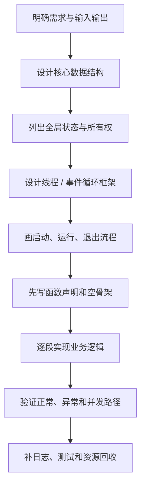
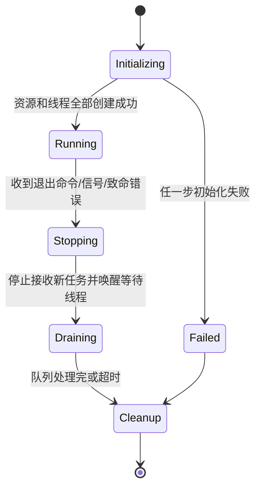

# 01 学习路线与程序设计方法

这条学习路线不是把 API 分散地背下来，而是逐步建立一套能处理并发、网络和服务拆分问题的思考顺序。学习内容依次从线程与同步、生产者—消费者、日志组件，推进到 TCP、I/O 多路复用和分层聊天服务器。

## 我形成的编程方法：先搭骨架，再写业务

经过这段时间的练习，我逐渐形成了一套固定顺序：**先写数据结构，再列全局状态，再画线程框架和生命周期，最后填业务逻辑**。这样做能在编码前回答“数据归谁、谁会修改、用什么同步、线程如何退出、错误如何传播”，减少写到一半才发现结构需要推倒重来的情况。



### 第一步：明确需求和边界

先写清楚程序接收什么、输出什么、允许多少并发、哪些操作可能阻塞，以及程序如何停止。不要一上来就写 `main()` 里的细节。

需要先回答：

- 有哪些角色：主线程、网络线程、工作线程、后台写盘线程？
- 哪些数据只被一个线程访问，哪些数据会共享？
- 输入来自终端、Socket、队列还是配置文件？
- 失败时是重试、返回错误、丢弃任务还是退出进程？
- 谁负责关闭文件描述符、销毁锁并通知其他线程停止？

### 第二步：先写数据结构

数据结构决定后续接口和同步边界。通常先定义：

```c
typedef struct {
    int fd;
    int id;
    char name[64];
    int state;
} Client;

typedef struct {
    Task items[QUEUE_CAPACITY];
    size_t head;
    size_t tail;
    size_t size;
    pthread_mutex_t mutex;
    pthread_cond_t not_empty;
    pthread_cond_t not_full;
    int stopping;
} TaskQueue;
```

设计时同时记录每个字段的不变量，例如 `0 <= size <= capacity`、一个 `fd` 只能对应一个在线会话、队列中的任务必须拥有其数据而不是引用即将失效的栈变量。

### 第三步：列出全局变量及所有权

并不是所有变量都应该做成全局变量。这里只是先把跨线程共享状态集中列出来，并为每一项标注保护方式：

| 状态 | 谁读 | 谁写 | 保护方式 | 生命周期 |
| --- | --- | --- | --- | --- |
| 客户端表 | 网络线程、工作线程 | 网络线程/清理逻辑 | 同一把互斥锁或单线程所有权 | 服务启动到退出 |
| 任务队列 | 网络线程 | 工作线程 | mutex + not_empty/not_full | 线程池生命周期 |
| 停止标记 | 所有线程 | 主线程/信号处理流程 | 原子变量或同一同步域 | 初始化到回收 |
| 日志缓冲区 | 业务线程 | 日志线程 | mutex + condition variable | Logger 生命周期 |

如果一个状态没有明确的所有者，就很容易出现多个线程随意修改、锁顺序不一致或重复释放。

### 第四步：画线程框架

在线程创建前先做一张线程表：

| 线程 | 输入 | 输出 | 可能阻塞的位置 | 退出条件 |
| --- | --- | --- | --- | --- |
| 主线程 | 参数、配置 | 全局初始化结果 | `pthread_join` | 所有子线程结束 |
| 网络线程 | Socket 事件 | Task | `epoll_wait` / `recv` | stopping 或监听 fd 关闭 |
| 工作线程 | TaskQueue | 业务结果 | `pthread_cond_wait` | stopping 且队列为空 |
| 日志线程 | LogQueue | 文件/控制台 | 条件变量、磁盘 I/O | stopping 且缓冲区已清空 |

线程函数统一成 `void *worker(void *arg)`，并提前约定参数对象由谁创建、何时释放。

### 第五步：先写启动、运行、退出三个阶段



初始化失败也必须走资源回收路径；退出时先停止生产新任务，再唤醒消费者、等待线程结束，最后销毁锁和关闭文件描述符。

### 第六步：填业务逻辑并逐层验证

推荐按以下顺序实现：

1. 单线程、单连接的最小正确流程；
2. 数据结构操作和边界检查；
3. 同步和线程退出；
4. 多连接或多生产者/消费者；
5. 超时、断线、空队列、满队列等异常路径；
6. 日志、统计和压力测试。

## 这套方法如何应用到各练习

| 练习 | 先定义的数据 | 再定义的并发框架 | 最后实现的业务 |
| --- | --- | --- | --- |
| 银行账户 | balance、mutex、cond | 3 个存款线程 + 2 个取款线程 | 随机存取、余额不足等待 |
| 生产者—消费者 | 有界队列、head/tail/size、停止状态 | 2 个生产者 + 3 个消费者 + 统计线程 | 超时 Push/Pop、完成判定 |
| 异步日志 | LogRecord、双缓冲、输出目标 | 业务线程生产 + 后台线程消费 | 过滤、格式化、写盘、滚动 |
| TCP 服务端 | 监听 fd、连接对象、收发缓冲 | 接收线程/发送线程或事件循环 | accept、收包、发包、关闭 |
| epoll 聊天室 | Client 表、历史记录、epoll events | 单事件循环或事件循环 + 工作线程 | 登录、广播、退出、清理 |
| 分层聊天系统 | Session、Task、ACK、历史缓存 | Client/Logic/Data 各自线程框架 | 存盘确认后广播、心跳、重连 |

## 学习路线

1. [线程与同步](02-threads-and-synchronization.md)：掌握线程生命周期、锁、条件变量、信号量和死锁。
2. [并发实践](03-concurrency-practices.md)：用银行账户与生产者—消费者验证同步模型。
3. [日志系统](04-logging-system.md)：把队列、线程和慢 I/O 组合成可复用组件。
4. [I/O 多路复用](05-io-multiplexing.md)：从阻塞、轮询、`select` 过渡到 `epoll`。
5. [TCP 编程](06-tcp-programming.md)：掌握服务端/客户端连接、收发和关闭流程。
6. [游戏聊天服务器](07-game-chat-server.md)：综合应用网络、并发、协议、持久化和服务分层。
7. [复盘与下一步](08-review-and-next-steps.md)：用检查清单审视程序是否真正完整。

## 编码前检查清单

- [ ] 核心结构体和字段不变量是否写清楚？
- [ ] 每个共享变量由谁读写、由哪把锁保护？
- [ ] 每个线程的输入、输出、阻塞点和退出条件是什么？
- [ ] 锁、条件变量、Socket、文件和堆内存由谁释放？
- [ ] 正常流程、超时、断线、队列满/空是否都有分支？
- [ ] 日志能否定位到模块、级别、线程、文件和行号？
- [ ] 是否能先用最小场景验证，再扩大并发规模？
