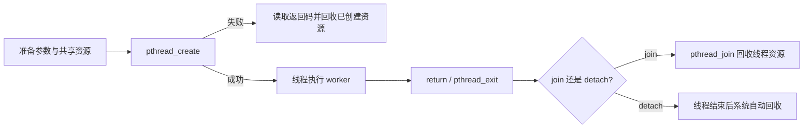
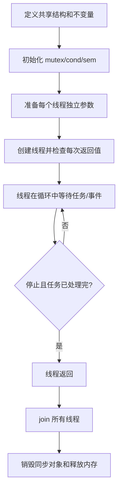

# 02 线程与同步

线程让同一个进程中的多个执行流并发推进。它们共享地址空间、全局变量和打开的文件描述符，因此创建线程并不难，真正困难的是**参数生命周期、共享状态同步、等待条件和安全退出**。

## 1. `pthread_create`：创建线程

线程函数必须符合固定签名：

```c
void *worker(void *arg) {
    /* 从 arg 取出参数 */
    return NULL;
}
```

最基本的使用顺序：

```c
pthread_t tid;
WorkerArgs args = {.id = 1};

int rc = pthread_create(&tid, NULL, worker, &args);
if (rc != 0) {
    /* pthread 接口通常直接返回错误码，不一定设置 errno */
}

pthread_join(tid, NULL);
```

### 参数解释

| 参数 | 含义 | 常见写法 |
| --- | --- | --- |
| `pthread_t *thread` | 保存新线程 ID | `&tid` |
| `const pthread_attr_t *attr` | 线程属性 | 不定制时传 `NULL` |
| `void *(*start_routine)(void *)` | 线程入口函数 | `worker` |
| `void *arg` | 传给线程的一个指针 | 结构体地址 |

### 最容易犯的生命周期错误

循环里把同一个局部变量地址传给多个线程，会导致线程读到被后续循环覆盖的值：

```c
/* 错误示意 */
for (int i = 0; i < 4; ++i) {
    pthread_create(&tids[i], NULL, worker, &i);
}
```

更安全的做法是为每个线程准备独立且持续有效的参数对象，并在所有线程使用完后再释放。主线程也不能在子线程工作期间直接 `return`，否则整个进程结束。

## 2. 线程生命周期



- `pthread_join(tid, &retval)`：等待指定线程结束并回收资源；同一线程不能被重复 join。
- `pthread_detach(tid)`：线程结束后自动回收，之后不能再 join。
- `pthread_self()`：取得当前线程 ID。
- `pthread_exit(retval)`：只结束调用它的线程；在 `main` 中调用可让其他线程继续运行。

## 3. 数据竞争和临界区

当多个线程访问同一个对象，并且至少一个线程写入，如果没有正确同步，就产生数据竞争。它可能表现为计数丢失、读到中间状态、链表或队列指针损坏，甚至随机崩溃。

锁保护的不是“某个变量名”，而是一组必须同时成立的不变量。例如队列的 `head`、`tail`、`size` 必须在同一个临界区内一起更新。

## 4. 互斥锁 `pthread_mutex_*`

```c
pthread_mutex_t mutex = PTHREAD_MUTEX_INITIALIZER;

pthread_mutex_lock(&mutex);
/* 只访问或修改由 mutex 保护的共享状态 */
pthread_mutex_unlock(&mutex);
```

动态生命周期则使用：

```c
pthread_mutex_init(&mutex, NULL);
/* 使用 */
pthread_mutex_destroy(&mutex);
```

使用原则：

- 同一份共享状态始终由同一把锁保护；
- 所有返回路径都必须解锁，可使用统一 `cleanup` 标签或 C++ RAII；
- 临界区只做必要的内存操作，不持锁进行磁盘 I/O、网络 I/O、休眠或长时间计算；
- `pthread_mutex_trylock()` 适合“拿不到就换策略”的场景，不能用忙循环反复调用；
- 销毁锁之前必须确认没有线程仍在持有或等待它。

## 5. 读写锁 `pthread_rwlock_*`

读写锁允许多个读者并行，但写者必须独占：

```c
pthread_rwlock_rdlock(&rwlock);  /* 只读共享数据 */
pthread_rwlock_unlock(&rwlock);

pthread_rwlock_wrlock(&rwlock);  /* 修改共享数据 */
pthread_rwlock_unlock(&rwlock);
```

它适合读多写少、读操作并不非常短的场景。若临界区很小或写操作频繁，普通互斥锁更简单，性能也可能更稳定。还要关注实现是否会造成读者或写者饥饿。

## 6. 条件变量 `pthread_cond_*`

条件变量用于等待“某个受互斥锁保护的条件变为真”。它不是事件计数器，也不单独保存通知。正确写法必须使用 `while`：

```c
pthread_mutex_lock(&mutex);
while (!predicate()) {
    pthread_cond_wait(&cond, &mutex);
}
/* 条件成立，继续操作共享状态 */
pthread_mutex_unlock(&mutex);
```

`pthread_cond_wait()` 会原子地释放互斥锁并阻塞；被唤醒后先重新取得锁再返回。必须重新检查条件，因为可能发生虚假唤醒，或者其他线程先一步改变了状态。

通知方式：

- `pthread_cond_signal()`：唤醒至少一个等待者；
- `pthread_cond_broadcast()`：唤醒所有等待者，让它们重新竞争锁并检查条件；
- `pthread_cond_timedwait()`：带绝对截止时间的等待，适合超时控制。

推荐顺序是：持锁修改条件相关状态 → 发出 signal/broadcast → 解锁。真正决定能否继续的始终是共享状态，而不是“收到过通知”。

## 7. 信号量 `sem_wait` / `sem_post`

信号量是非负计数器，用于控制可用资源数量或线程间的先后关系：

```c
sem_t slots;
sem_init(&slots, 0, 4);   /* 同进程线程共享，最多允许 4 个并发使用者 */

sem_wait(&slots);         /* 计数为 0 时阻塞，否则原子减 1 */
/* 使用有限资源 */
sem_post(&slots);         /* 原子加 1，可能唤醒等待者 */

sem_destroy(&slots);
```

### 类型

- 无名信号量：`sem_init` / `sem_destroy`，通常位于进程内存中；第二个参数为 0 时供同进程线程共享。
- 有名信号量：`sem_open` / `sem_close` / `sem_unlink`，由系统按名字管理，可供多个进程访问。
- 二进制信号量：值通常为 0 或 1，可做等待—通知，但没有互斥锁的“所有者”语义。
- 计数信号量：值为 0 到 N，常用于连接池、并发限流或队列空位/数据数量。

不要把 `sem_post` 次数做得比实际资源归还次数多，否则计数会与真实资源不一致。持有互斥锁时再阻塞等待信号量，也可能形成死锁。

## 8. 同步工具如何选择

| 工具 | 表达的问题 | 典型场景 |
| --- | --- | --- |
| 互斥锁 | 同一时刻只能有一个线程修改共享状态 | 账户余额、客户端表、队列结构 |
| 读写锁 | 多读者可并行，写者独占 | 读多写少的配置或缓存索引 |
| 条件变量 | 等待某个共享状态满足条件 | 队列非空、余额足够、停止信号 |
| 计数信号量 | 有多少份资源可用 | 限制并发数、连接池、缓冲区槽位 |

## 9. 死锁

死锁出现需要四个条件同时成立：互斥、持有并等待、不可抢占、循环等待。工程中最常见的是线程 A 持有锁 1 等锁 2，而线程 B 持有锁 2 等锁 1。

避免方法：

1. 为多把锁规定全局固定顺序；
2. 减少同时持有多把锁的设计；
3. 不在持锁期间等待网络、文件、条件变量之外的另一类资源；
4. 必要时使用 `trylock` 或带超时的等待并设计回退路径；
5. 用封装函数统一成对的加锁和解锁。

## 10. 线程模块骨架



## 常见错误检查表

- [ ] 是否把即将离开作用域的局部变量地址传给线程？
- [ ] 是否检查了 `pthread_create` 的返回码？
- [ ] 创建成功的线程最终是否 join 或 detach？
- [ ] 条件变量是否与同一把 mutex 和 `while` 条件一起使用？
- [ ] 是否在持锁期间做了阻塞 I/O 或 sleep？
- [ ] 多把锁是否遵循固定顺序？
- [ ] 停止时是否广播唤醒所有等待线程？
