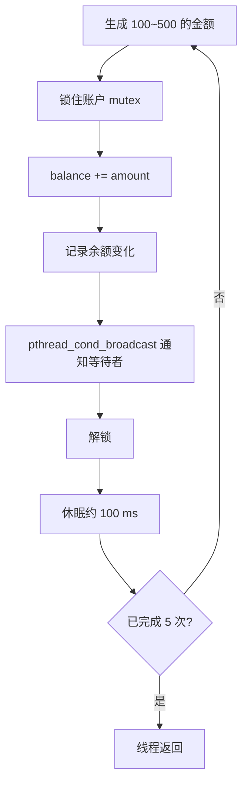
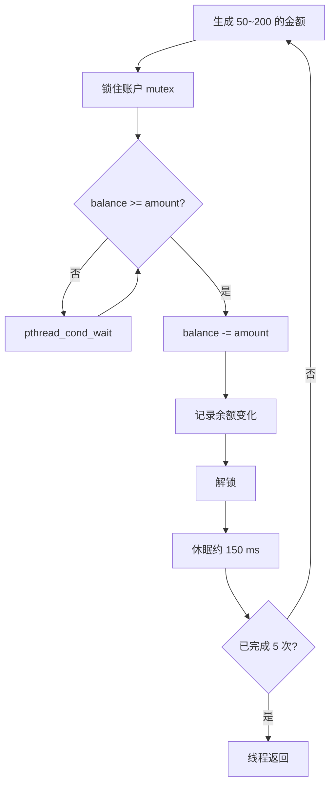
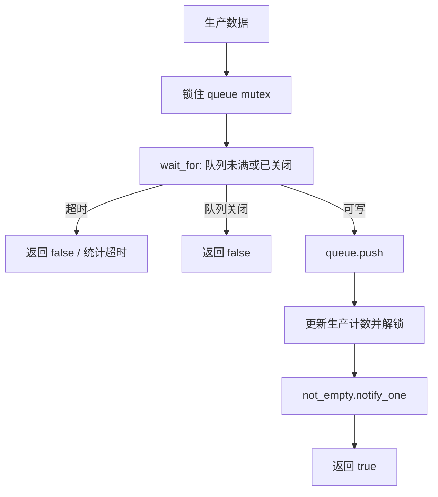
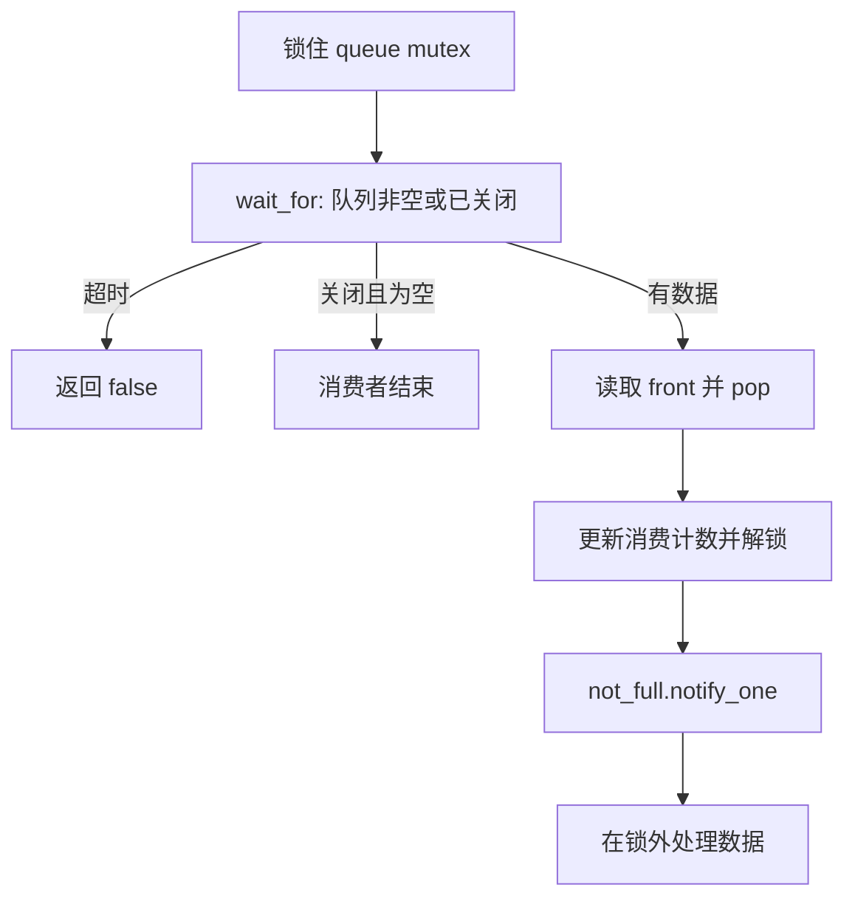
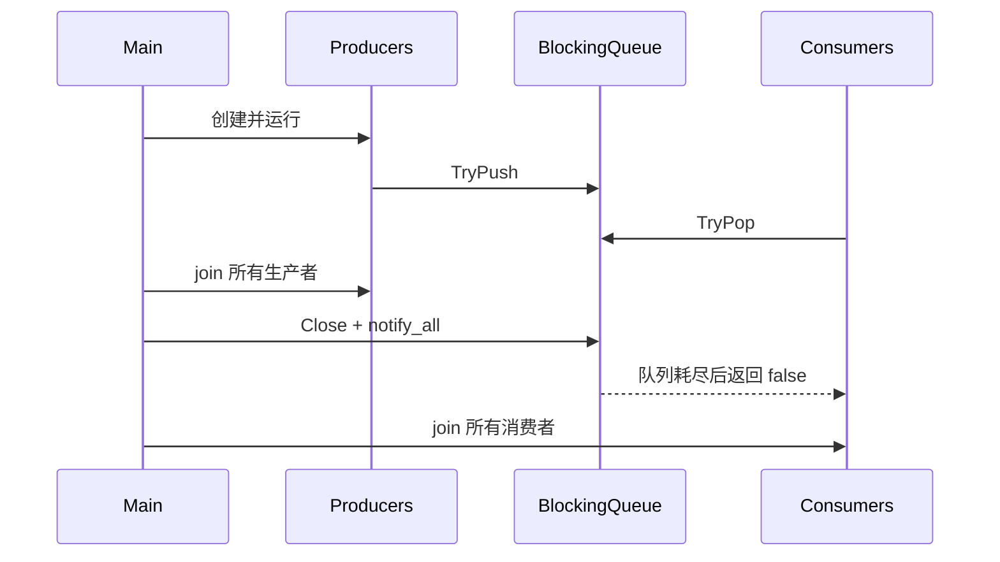

# 03 并发实践：银行账户与生产者—消费者

这一章用两个练习把互斥锁、条件变量、有界队列和线程退出落到具体程序中。重点不是“能启动多个线程”，而是先写清数据结构、不变量、线程角色和等待条件。

## 一、多线程银行账户系统

### 1. 需求

- 一个账户，初始余额 1000 元；
- 3 个存款线程，每个循环 5 次，每次存入 100～500 元，间隔约 100 ms；
- 2 个取款线程，每个循环 5 次，每次取出 50～200 元，间隔约 150 ms；
- 余额不足时取款线程不能把余额扣成负数，而是等待存款发生后重新检查。

### 2. 先定义数据和同步对象

```c
typedef struct {
    int balance;
    pthread_mutex_t mutex;
    pthread_cond_t enough_money;
} Account;

typedef struct {
    int thread_id;
    Account *account;
    unsigned int seed;
} WorkerArgs;
```

核心不变量：

- `balance >= 0`；
- 读取、判断和修改 `balance` 必须由同一把 `mutex` 保护；
- “余额是否足够”必须在持锁时判断；
- 每个线程使用独立随机种子，避免共享随机数状态产生额外竞争。

### 3. 线程框架

| 线程 | 数量 | 输入 | 修改的状态 | 阻塞点 |
| --- | ---: | --- | --- | --- |
| 存款线程 | 3 | Account、线程 ID | balance | mutex、sleep |
| 取款线程 | 2 | Account、线程 ID | balance | mutex、cond、sleep |
| 主线程 | 1 | 无 | 初始化/销毁 | join |

### 4. 存款流程



### 5. 取款流程



对应代码模式：

```c
pthread_mutex_lock(&account->mutex);
while (account->balance < amount) {
    pthread_cond_wait(&account->enough_money, &account->mutex);
}
account->balance -= amount;
pthread_mutex_unlock(&account->mutex);
```

不能用 `if` 代替 `while`。多个取款线程同时被唤醒时，先取得锁的线程可能已经取走一部分余额，后取得锁的线程必须重新检查。存款应在修改余额后 `signal` 或 `broadcast`。

### 6. 主函数顺序

1. 初始化账户余额、互斥锁和条件变量；
2. 准备每个线程独立的参数；
3. 创建 3 个存款线程和 2 个取款线程，并检查每次创建结果；
4. join 所有成功创建的线程；
5. 输出最终余额并验证不变量；
6. 销毁条件变量和互斥锁。

完整案例见 [`examples/bank_account.c`](examples/bank_account.c)。

## 二、生产者—消费者模型

### 1. 什么时候使用

当“产生数据”和“处理数据”的速度不同，或希望两者互不阻塞时，可以在中间放一个有界缓冲区。生产者只负责生成任务，消费者只负责处理任务，队列负责解耦。日志、网络收包、磁盘写入和线程池都能使用这一模型。

本练习设定：2 个生产者各产生 50 个数据；3 个消费者以不同速度处理；共享容量 20 的阻塞队列；统计线程每秒输出进度；Push/Pop 支持超时。

### 2. 阻塞队列数据结构

```cpp
class BlockingQueue {
public:
    explicit BlockingQueue(std::size_t capacity);
    bool TryPush(int value, int timeout_ms);
    bool TryPop(int& value, int timeout_ms);
    void Close();
private:
    std::queue<int> queue_;
    std::size_t capacity_;
    bool closed_ = false;
    std::mutex mutex_;
    std::condition_variable not_empty_;
    std::condition_variable not_full_;
};
```

队列不变量是 `0 <= queue_.size() <= capacity_`。`queue_`、`closed_` 和完成条件都必须在 `mutex_` 的同步域内访问。

### 3. 两个条件变量

- `not_full_`：队列还有空位。队列满时生产者等待，消费者 Pop 后通知；
- `not_empty_`：队列中有数据。队列空时消费者等待，生产者 Push 后通知。

条件变量的名称描述“等待者想要的条件”，而不是谁发送通知。

### 4. `TryPush` 流程



```cpp
std::unique_lock<std::mutex> lock(mutex_);
bool ready = not_full_.wait_for(
    lock, std::chrono::milliseconds(timeout_ms),
    [&] { return queue_.size() < capacity_ || closed_; });
if (!ready || closed_) return false;
queue_.push(value);
lock.unlock();
not_empty_.notify_one();
return true;
```

### 5. `TryPop` 流程



消费者结束条件不能只是“当前队列为空”，因为生产者之后可能继续放数据。完整条件是：生产已结束并且队列为空，或者队列已 `Close()` 且为空。

### 6. 关闭流程



`Close()` 应在持锁时设置 `closed_ = true`，随后对 `not_empty_` 和 `not_full_` 执行 `notify_all()`，否则仍可能有线程永久等待。

### 7. 统计线程

统计线程每秒读取生产总数、消费总数和队列长度。共享计数使用原子变量或锁。统计线程也必须有停止条件，不能留下永不退出的 `while (true)`。

完整案例见 [`examples/producer_consumer.cpp`](examples/producer_consumer.cpp)。

## 三、对照总结

| 问题 | 银行账户 | 生产者—消费者 |
| --- | --- | --- |
| 共享状态 | balance | queue、closed、计数 |
| 互斥锁保护 | 判断 + 修改余额 | 检查 + Push/Pop |
| 等待条件 | 余额足够 | 非空 / 非满 |
| 唤醒者 | 存款线程 | Push 唤醒消费者，Pop 唤醒生产者 |
| 退出难点 | 固定次数操作完成 | 生产结束且队列耗尽 |

## 常见错误

- 在锁外检查条件，进入锁后状态已经变化；
- 用 `if` 等待条件变量，没有处理虚假唤醒；
- 通知了错误的条件变量；
- 队列暂时为空就结束消费者；
- 生产者结束后没有 `notify_all`；
- 统计线程读取普通计数时没有同步；
- 持锁执行耗时的消费逻辑，导致生产者无法进入队列。
