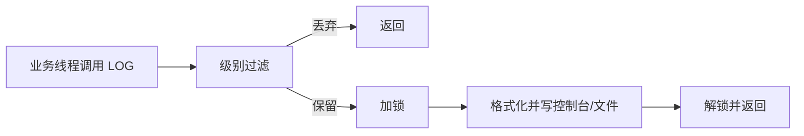
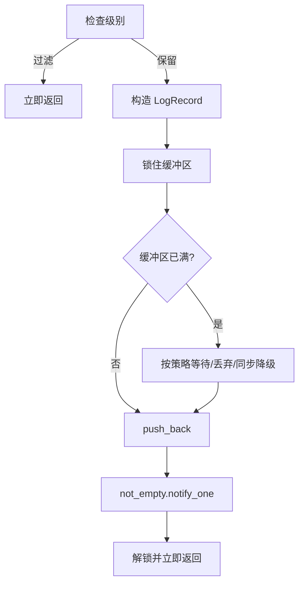
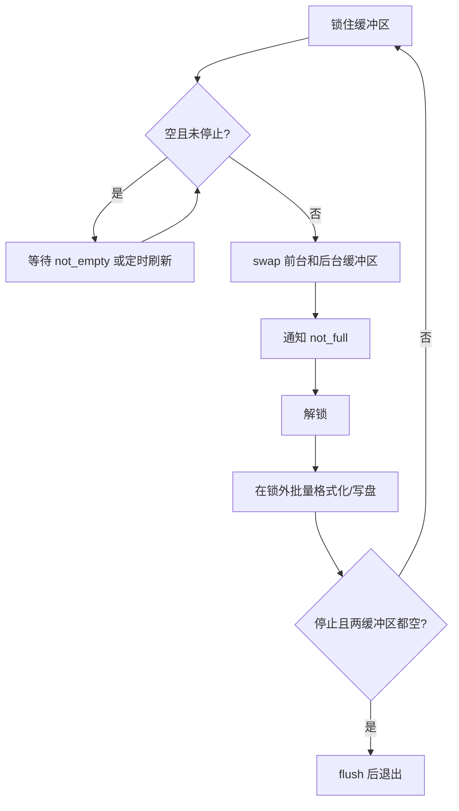
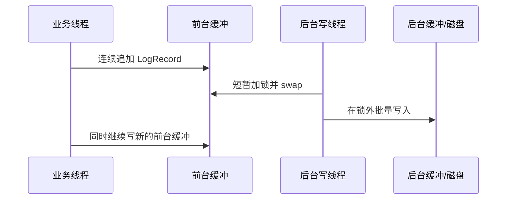
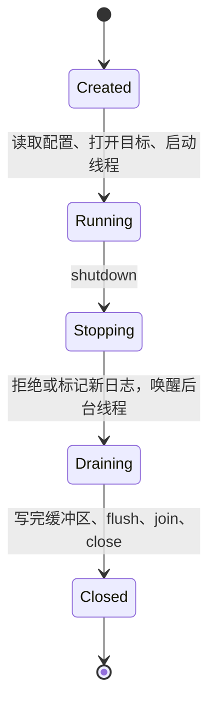

# 04 日志系统：从同步输出到异步双缓冲

日志系统是并发知识第一次组件化应用：多个业务模块生产日志，控制台、文件或网络输出目标消费日志，中间用缓冲区把业务线程和慢速 I/O 解耦。

## 1. 功能演进目标

| 阶段 | 能力 | 解决的问题 |
| --- | --- | --- |
| 1 | 日志级别过滤 + 控制台输出 | 只显示当前需要关注的日志 |
| 2 | 宏封装 + 自动捕获位置 | 调用简单，自动记录文件、行号和函数 |
| 3 | 配置文件 + 文件输出 | 不改代码即可调整级别，日志能够持久化 |
| 4 | 多输出目标 + 线程安全 | 控制台、文件、网络同时输出且内容不串行错乱 |
| 5 | 异步日志 | 写日志不让业务线程等待磁盘 |
| 6 | 文件滚动 + 分类日志 | 文件不会无限增长，不同模块可以独立过滤 |

## 2. 先设计数据结构

```cpp
enum class LogLevel { Debug, Info, Warn, Error, Fatal };

struct LogRecord {
    LogLevel level;
    std::string module;
    std::string message;
    std::string file;
    std::string function;
    int line;
    std::chrono::system_clock::time_point time;
    std::thread::id thread_id;
};

struct LoggerConfig {
    LogLevel default_level;
    std::size_t buffer_capacity;
    std::size_t max_file_bytes;
    bool console_enabled;
    bool file_enabled;
    std::string file_path;
};
```

日志记录在进入队列之前应拥有自己的字符串数据，不能保存指向调用者临时缓冲区的裸指针。

## 3. 全局状态和所有权

| 状态 | 所有者/访问者 | 同步方式 |
| --- | --- | --- |
| 当前配置 | Logger，业务线程只读 | 初始化后只读或读写锁 |
| 前台缓冲区 | 所有产生日志的线程 | mutex |
| 后台缓冲区 | 日志线程 | 交换时受 mutex 保护，写盘时独占使用 |
| `running/stopping` | 主线程和日志线程 | 原子变量或同一 mutex |
| 文件句柄与当前大小 | 日志线程 | 单线程所有权 |

把文件句柄限定为后台线程所有，可以避免每条日志都争抢文件锁。

## 4. 日志级别和模块过滤

典型顺序为 `DEBUG < INFO < WARN < ERROR < FATAL`。调用日志函数时先比较模块阈值，低于阈值的日志直接返回，不进行字符串格式化和入队。

模块示例：

```text
default  -> INFO
network  -> WARN
database -> ERROR
security -> INFO
```

配置应先应用模块规则，再回退到默认级别。模块名不存在时不能导致崩溃。

## 5. 宏封装

```cpp
#define LOG_INFO(module, message) \
    Logger::Instance().Log(LogLevel::Info, module, message, \
                           __FILE__, __LINE__, __func__)
```

`__FILE__`、`__LINE__` 和 `__func__` 在调用点展开，因此能记录问题来自哪里。宏参数要加括号，避免带表达式时出现优先级问题；不要在宏中重复求值有副作用的参数。

## 6. 同步日志流程

最简单的线程安全方案是在格式化和输出时加锁：



它容易实现，但磁盘慢、日志量大时，业务线程会在锁和文件 I/O 上等待。

## 7. 异步日志：生产者—消费者

业务线程只负责生成 `LogRecord` 并放入缓冲区，后台线程批量写出。

### 业务线程流程



### 后台线程流程



关键点是 `swap` 后立刻释放锁，慢速磁盘 I/O 在锁外完成。

## 8. 双缓冲为什么有效



两个缓冲区并不是让两个线程完全无锁，而是把共享锁持有时间缩短到“交换容器”这一小段。

## 9. 满缓冲区策略

日志生产速度超过消费速度时，必须明确策略：

| 策略 | 优点 | 风险 | 适用 |
| --- | --- | --- | --- |
| 阻塞等待 `not_full` | 不丢日志 | 业务线程被拖慢 | 审计、交易等不能丢的日志 |
| 超时后丢弃 | 控制最大阻塞时间 | 丢失信息 | 高频调试日志 |
| 丢弃旧日志 | 保留最近状态 | 失去完整过程 | 实时监控 |
| 同步降级写出 | 尽量保留 | 高峰期延迟突然升高 | ERROR/FATAL 兜底 |

丢弃时至少维护 `dropped_count`，并定期输出汇总，不能静默丢失。

## 10. 文件滚动

常见触发条件：

- 按大小：当前文件超过 `max_file_bytes`；
- 按时间：每天或每小时生成新文件；
- 大小与时间组合。

滚动顺序：flush 当前文件 → close → 重命名或生成带时间/序号的新文件 → open → 重置大小计数。文件名可以包含模块、日期和序号，例如 `network-20260904-001.log`。

要限制保留文件数量并处理磁盘已满、权限不足、重命名失败等错误。日志组件本身报错时不能无限递归调用自己。

## 11. 初始化、运行和退出



退出时不能先关闭文件再让后台线程继续写。正确顺序是设置停止标志、唤醒线程、排空缓冲、join、flush/close，最后销毁条件变量和锁。

## 12. 最小使用示例

```cpp
LoggerConfig config;
config.default_level = LogLevel::Info;
config.buffer_capacity = 4096;
config.file_enabled = true;
config.file_path = "server.log";

Logger::Instance().Init(config);
LOG_INFO("network", "server started");
LOG_ERROR("database", "redis connection failed");
Logger::Instance().Shutdown();
```

代码案例见 [`examples/logging_system.cpp`](examples/logging_system.cpp)。

## 验证清单

- [ ] 10 个线程并发写日志时，每条记录是否完整且不串行错乱？
- [ ] 低于模块阈值的日志是否在格式化前被过滤？
- [ ] 缓冲区满时策略是否符合预期，是否记录丢弃数？
- [ ] 空闲时是否定时刷新，而不是日志永久留在内存？
- [ ] 文件滚动后是否继续写入正确文件？
- [ ] shutdown 是否写完剩余日志并正常 join？
- [ ] 磁盘满或文件打不开时是否有可控的降级行为？
