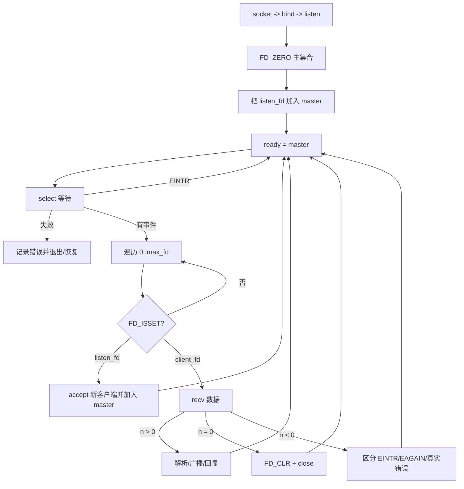
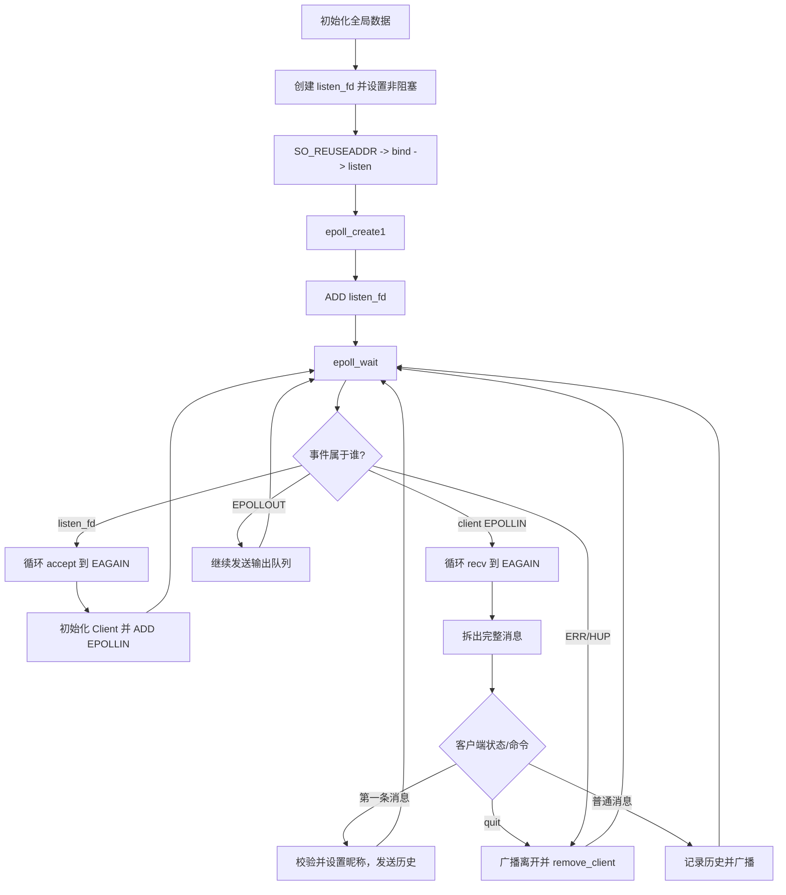
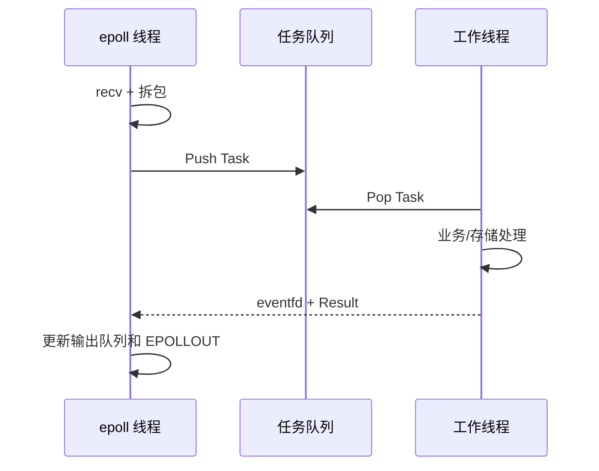

# 05 I/O 多路复用：从阻塞到 `select` 与 `epoll`

I/O 多路复用解决的是“一个线程如何等待和管理多个文件描述符的就绪事件”。它不会自动让业务逻辑变快，也不会替你处理消息边界、慢客户端和线程安全。

## 1. 四种处理方式对比

| 模型 | 做法 | 优点 | 主要问题 |
| --- | --- | --- | --- |
| 单线程同步阻塞 | 对一个 socket `recv`，没有数据就等待 | 简单 | 一个连接阻塞会影响其他连接 |
| 每连接一线程 | 每个 socket 由独立线程阻塞处理 | 编程直观 | 连接多时线程栈、调度和切换成本高 |
| 同步非阻塞轮询 | 每个 socket 都设为非阻塞并循环尝试 | 单个 socket 不拖住其他连接 | 重复遍历和系统调用，空转消耗 CPU |
| I/O 多路复用 | 让内核等待多个 fd，返回就绪集合 | 少量线程管理大量连接 | 仍需正确维护连接状态和收发缓冲 |

## 2. `select`

`select` 使用 `fd_set` 表示关注的文件描述符集合。调用后，它会把集合改写成“本次就绪的 fd”，所以每次循环必须从主集合复制一份工作集合。

### 核心接口

```c
FD_ZERO(&master);          /* 清空集合 */
FD_SET(listen_fd, &master);/* 加入 fd */
FD_CLR(fd, &master);       /* 移除 fd */
FD_ISSET(fd, &ready);      /* 检查本次是否就绪 */

int n = select(max_fd + 1, &ready, NULL, NULL, &timeout);
```

`select` 参数：

| 参数 | 含义 |
| --- | --- |
| `nfds` | 最大 fd 加 1，不是集合元素数量 |
| `readfds` | 关注可读事件，包括监听 socket 上的新连接 |
| `writefds` | 关注可写事件；不要一直监听，否则常常持续就绪 |
| `exceptfds` | 异常条件集合 |
| `timeout` | `NULL` 永久阻塞；零值立即返回；其他值超时返回 |

### `select` 服务器流程



### `select` 的限制

- 每次调用都要从用户态复制 fd 集合，并在用户态遍历；
- fd 数量受 `FD_SETSIZE` 限制；
- fd 值很大但连接很少时，仍要遍历到 `max_fd`；
- 关闭最大 fd 后需要重新计算 `max_fd`，否则会做无效遍历。

## 3. `epoll`

Linux `epoll` 在内核维护关注集合，并把已就绪事件返回给应用，不要求每次传入整个 fd 集合。

### 三个核心接口

```c
int epfd = epoll_create1(EPOLL_CLOEXEC);

struct epoll_event ev = {0};
ev.events = EPOLLIN | EPOLLRDHUP;
ev.data.fd = listen_fd;
epoll_ctl(epfd, EPOLL_CTL_ADD, listen_fd, &ev);

int n = epoll_wait(epfd, events, MAX_EVENTS, -1);
```

`epoll_ctl` 操作：

- `EPOLL_CTL_ADD`：把新 fd 加入关注集合；
- `EPOLL_CTL_MOD`：修改关心的事件，例如发送队列非空时增加 `EPOLLOUT`；
- `EPOLL_CTL_DEL`：移除 fd。关闭前显式删除能让生命周期更清楚。

### 常用事件

| 事件 | 含义 | 处理建议 |
| --- | --- | --- |
| `EPOLLIN` | 可读或监听 socket 有连接 | 循环 accept/recv，解析完整消息 |
| `EPOLLOUT` | 当前可继续发送 | 发送输出队列，清空后取消关注 |
| `EPOLLERR` | socket 错误 | 用 `getsockopt(SO_ERROR)` 获取原因并清理 |
| `EPOLLHUP` | 连接挂断 | 清理连接 |
| `EPOLLRDHUP` | 对端关闭写方向 | 处理半关闭并决定是否继续发送 |

## 4. LT 与 ET

- LT（Level Triggered，水平触发）：只要 fd 仍可读/可写，就会继续通知。默认模式，较容易正确实现。
- ET（Edge Triggered，边沿触发）：状态从未就绪变为就绪时通知一次。必须把 fd 设为非阻塞，并持续 accept/recv/send 直到返回 `EAGAIN`。

ET 读流程：

```c
for (;;) {
    ssize_t n = recv(fd, buf, sizeof(buf), 0);
    if (n > 0) {
        append_to_input_buffer(conn, buf, (size_t)n);
    } else if (n == 0) {
        close_connection(conn);
        break;
    } else if (errno == EINTR) {
        continue;
    } else if (errno == EAGAIN || errno == EWOULDBLOCK) {
        break;
    } else {
        close_connection(conn);
        break;
    }
}
```

## 5. `epoll` 多人聊天室的数据结构

先定义结构，而不是先写事件循环：

```c
typedef struct {
    int fd;
    char name[64];
    int named;
    char input[8192];
    size_t input_len;
    char output[8192];
    size_t output_len;
} Client;
```

还需要：客户端表、历史消息队列、监听 fd、epoll fd、停止标记。必须决定这些数据只由事件循环线程修改，还是会被工作线程共享；如果采用单线程所有权，可以减少很多锁。

### 工具函数

| 函数 | 责任 |
| --- | --- |
| `get_time_str` | 生成时间戳 |
| `add_to_history` | 保存有限数量历史记录 |
| `broadcast_message` | 广播普通聊天，通常排除发送者 |
| `broadcast_system_msg` | 广播加入、离开等系统消息 |
| `remove_client` | 从 epoll 和客户端表删除并关闭 fd |
| `name_exists` | 检查昵称是否重复 |
| `assign_name` | 完成客户端登录状态转换 |
| `send_history` | 新客户端登录后发送历史 |

## 6. `epoll` 聊天室主流程



## 7. 不能忽略的发送问题

即使 socket 显示可写，一次 `send` 也可能只发送部分数据。应为每个连接维护输出缓冲和偏移：

1. 业务逻辑只把消息追加到输出队列；
2. 队列从空变为非空时，用 `EPOLL_CTL_MOD` 增加 `EPOLLOUT`；
3. 可写时循环发送，更新偏移；
4. 返回 `EAGAIN` 时保留剩余数据；
5. 队列清空后取消 `EPOLLOUT`，避免事件循环空转。

## 8. 事件循环和工作线程如何配合

事件循环适合快速完成 accept、收包、拆包和排队。数据库访问、磁盘写入、复杂计算不应阻塞事件循环，可以转交工作线程。工作线程不能随意关闭事件循环正在使用的 fd；更安全的方式是返回结果，由事件循环统一修改连接状态。



## 9. 常见错误

- `select` 循环中没有重新复制 `fd_set`；
- 把 `nfds` 写成连接数量，而不是最大 fd + 1；
- ET 模式只 `recv` 一次，没有读到 `EAGAIN`；
- 一直关注 `EPOLLOUT`，导致 CPU 空转；
- 假设一次 `recv` 就是一条完整消息；
- 假设一次 `send` 会发送完整缓冲区；
- close 后 fd 被系统复用，旧任务仍只凭 fd 操作新连接；
- 在遍历客户端表广播时同时删除元素，造成迭代器或索引失效。

代码案例：[`epoll_chat_server.c`](examples/epoll_chat_server.c) 和 [`epoll_chat_client.c`](examples/epoll_chat_client.c)。
