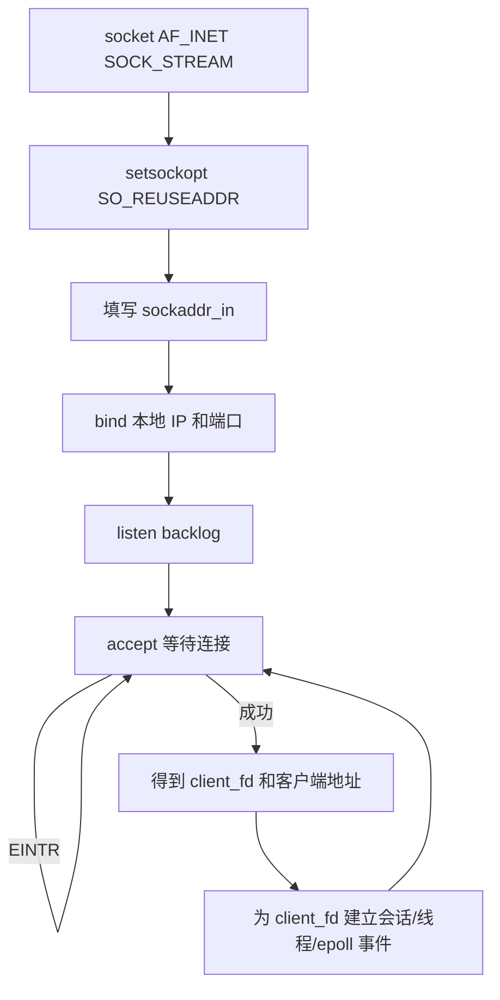
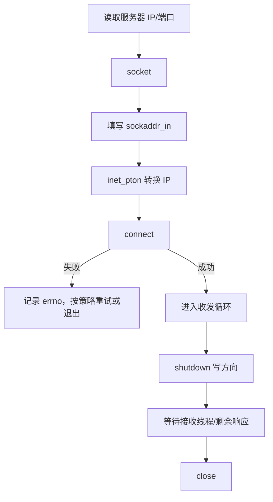
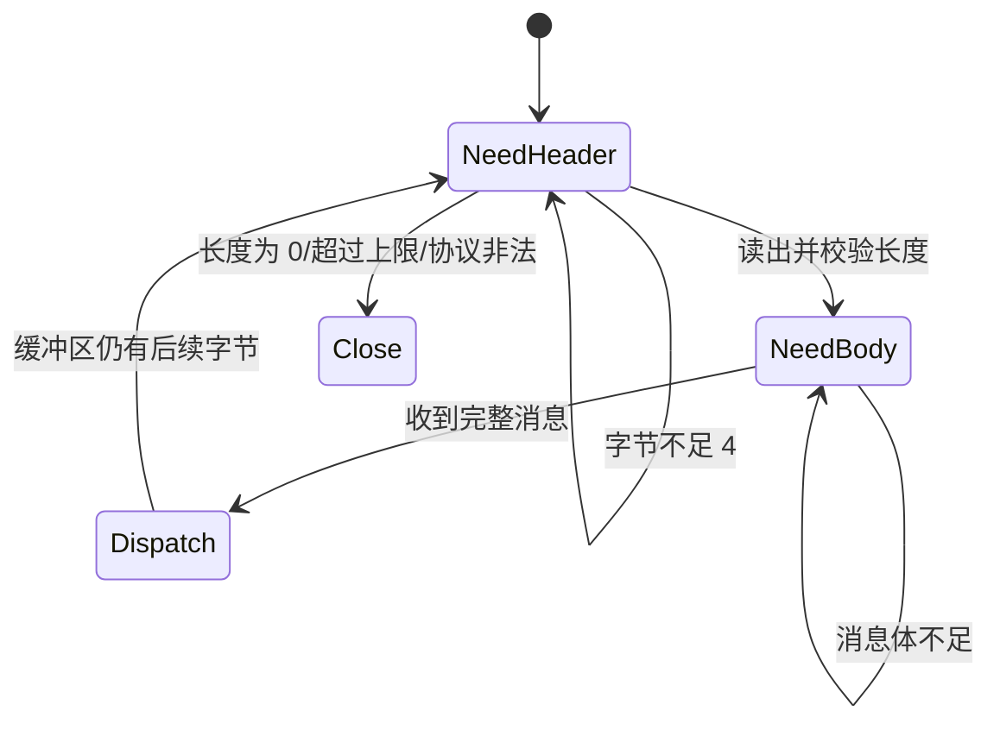
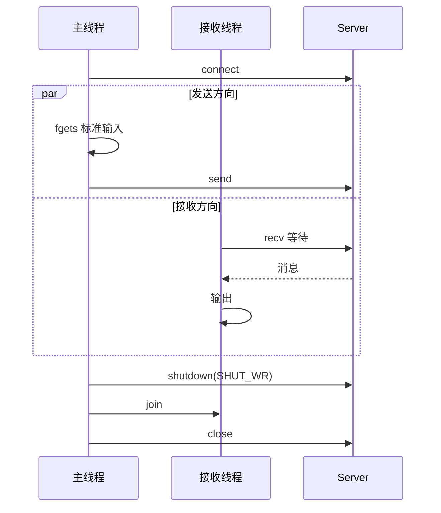

# 06 TCP 编程：Socket 服务端与客户端完整流程

TCP 提供可靠、有序、面向连接的**字节流**。它保证字节顺序，不保证一次 `send` 对应一次 `recv`，因此除了会调用 Socket API，还必须处理消息边界、半包、部分发送、断线和关闭顺序。

## 1. 基本概念

可以用打电话帮助记忆，但实现时要理解真正职责：

| API | 类比 | 实际作用 |
| --- | --- | --- |
| `socket` | 买一部手机 | 创建内核 Socket 对象，返回文件描述符 |
| `bind` | 绑定手机号 | 把本地 IP 和端口绑定到监听 Socket |
| `listen` | 开机等来电 | 把 Socket 转成被动监听状态并设置排队上限 |
| `accept` | 接起电话 | 从已完成连接队列取出一个新通信 Socket |
| `connect` | 拨号 | 客户端向服务端地址发起连接 |
| `recv/read` | 听对方说话 | 从接收缓冲区取字节 |
| `send/write` | 对话 | 向发送缓冲区写字节 |
| `shutdown` | 告诉对方不再说话 | 关闭读、写或两个方向 |
| `close` | 挂断并释放资源 | 释放当前进程持有的 fd 引用 |

IP 地址标识主机/网卡，端口号标识主机上的服务。服务端通常绑定固定端口，客户端本地端口一般由系统自动分配。

## 2. 监听 Socket 与通信 Socket

- 监听 Socket 只负责接受新连接，不用它和某个客户端收发聊天数据；
- `accept` 每成功一次会返回一个新的通信 Socket；
- 一个服务端通常只有少量监听 Socket，但会同时持有许多通信 Socket；
- 关闭某个通信 Socket 不应影响监听 Socket 和其他客户端。

## 3. 服务端启动流程



### 最小初始化代码

```c
int listen_fd = socket(AF_INET, SOCK_STREAM, 0);
if (listen_fd < 0) { /* error */ }

int yes = 1;
setsockopt(listen_fd, SOL_SOCKET, SO_REUSEADDR, &yes, sizeof(yes));

struct sockaddr_in addr;
memset(&addr, 0, sizeof(addr));
addr.sin_family = AF_INET;
addr.sin_addr.s_addr = htonl(INADDR_ANY);
addr.sin_port = htons(8888);

if (bind(listen_fd, (struct sockaddr *)&addr, sizeof(addr)) < 0) { /* error */ }
if (listen(listen_fd, 128) < 0) { /* error */ }
```

`htons`/`htonl` 把主机字节序转换为网络字节序。服务端重启时使用 `SO_REUSEADDR` 可以减少地址仍处于旧连接状态导致的绑定失败，但它不是让多个普通进程随意监听同一地址。

## 4. 客户端连接流程



```c
struct sockaddr_in server;
memset(&server, 0, sizeof(server));
server.sin_family = AF_INET;
server.sin_port = htons(8888);
inet_pton(AF_INET, "127.0.0.1", &server.sin_addr);

if (connect(fd, (struct sockaddr *)&server, sizeof(server)) < 0) {
    /* 连接失败或超时处理 */
}
```

## 5. `recv` 返回值必须分别处理

```c
ssize_t n = recv(fd, buffer, sizeof(buffer), 0);
if (n > 0) {
    /* 收到了 n 个字节；它不一定是一条完整消息 */
} else if (n == 0) {
    /* 对端已经正常关闭写方向 */
} else if (errno == EINTR) {
    /* 被信号中断，可重试 */
} else if (errno == EAGAIN || errno == EWOULDBLOCK) {
    /* 非阻塞 socket 暂时没有更多数据 */
} else {
    /* 真实错误，记录并清理连接 */
}
```

收到的是二进制字节时不能直接把缓冲区当 C 字符串打印；如果要打印文本，确保空间足够并在 `buffer[n]` 写入终止符。

## 6. `send` 可能只发送一部分

```c
int send_all(int fd, const void *data, size_t len) {
    const char *p = data;
    size_t sent = 0;
    while (sent < len) {
        ssize_t n = send(fd, p + sent, len - sent, MSG_NOSIGNAL);
        if (n > 0) { sent += (size_t)n; continue; }
        if (n < 0 && errno == EINTR) continue;
        return -1;
    }
    return 0;
}
```

阻塞 Socket 可以使用 `send_all` 循环；非阻塞 Socket 遇到 `EAGAIN` 时必须保留剩余数据，等 `EPOLLOUT` 再继续。Linux 上 `MSG_NOSIGNAL` 或忽略 `SIGPIPE` 可以避免向已关闭连接发送时进程被信号终止。

## 7. TCP 没有消息边界

下面三种接收结果都可能来自客户端两次 `send`：

```text
send: [HELLO] [WORLD]
recv: [HELLOWORLD]          粘在一起
recv: [HEL] [LOWO] [RLD]    被拆开
recv: [HELLO] [WORLD]       看起来刚好对应，但不能依赖
```

### 常见应用层协议

1. 定长消息：每条固定 N 字节；
2. 分隔符协议：以 `
` 结尾，需要处理内容转义和最大长度；
3. 长度前缀：例如 4 字节长度 + 消息体；
4. 结构化协议：长度前缀中再放 Protobuf、JSON 等消息。

长度前缀解析状态机：



每个连接需要独立输入缓冲和解析状态。读取新字节后可以一次拆出 0 条、1 条或多条消息。

## 8. 双向聊天的线程结构

基础练习可以让接收线程阻塞在 `recv`，主线程阻塞在 `fgets` 并负责发送：



如果输入 `quit`：主线程停止发送并 `shutdown(fd, SHUT_WR)`；接收线程仍可读取服务端剩余消息，直到 `recv` 返回 0，再由主线程 join 后 close。若需要立即终止阻塞中的接收线程，可设计统一停止机制，而不是多个线程同时无序 close 同一 fd。

## 9. 资源和错误处理顺序

- 每个系统调用都检查返回值并记录 `errno`；
- 部分初始化失败时，只清理已经创建成功的资源；
- fd 加入客户端表后明确由哪个模块关闭；
- 断开时先从 epoll/集合和业务映射删除，再 close；
- 避免工作线程保存一个可能被关闭并复用的裸 fd，可加入连接 ID/代次；
- 网络字节、字符串和结构体之间的转换必须检查长度。

## 10. 编译和验证

```bash
gcc -std=c11 -Wall -Wextra -pthread server.c -o server
gcc -std=c11 -Wall -Wextra -pthread client.c -o client
```

验证时不要只测试一次正常聊天，还应测试：服务器未启动、重复连接、客户端直接关闭、服务端退出、超长消息、空消息、快速连续发送、网络线程被信号中断等情况。
