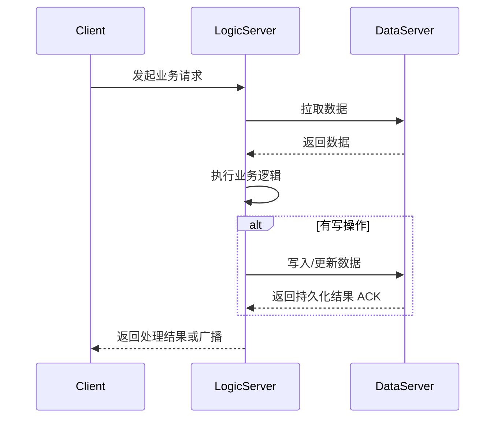
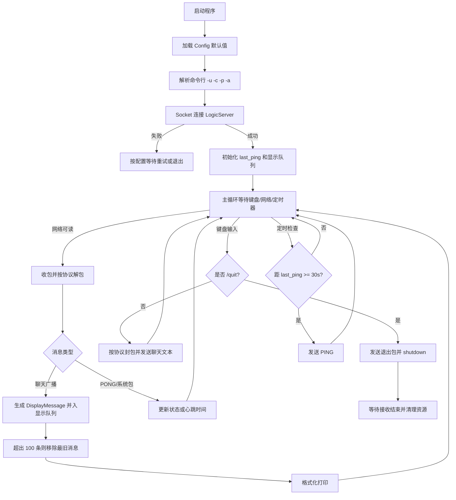
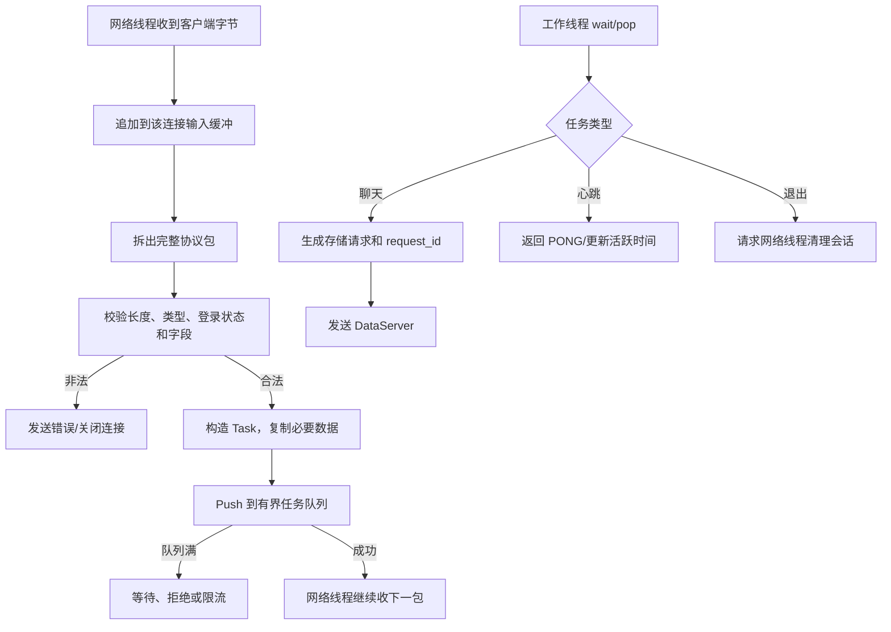
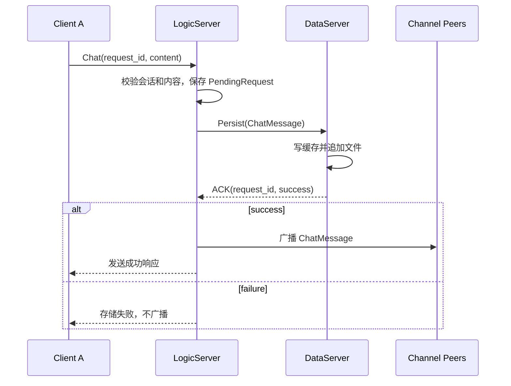
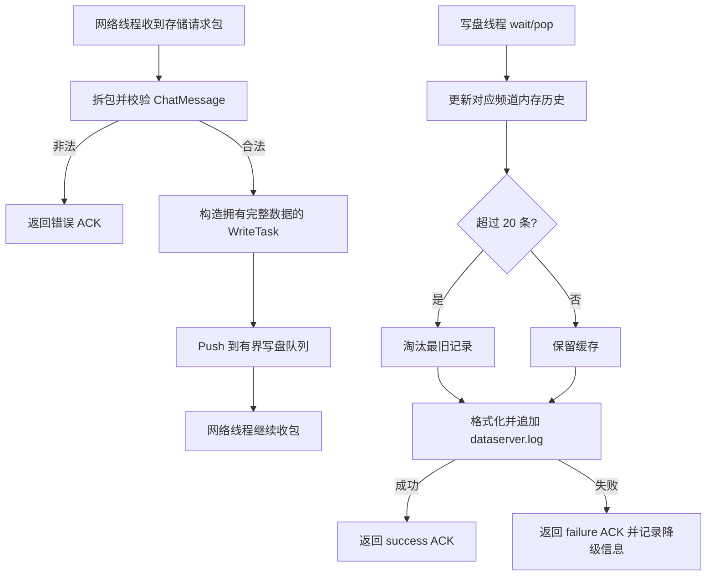
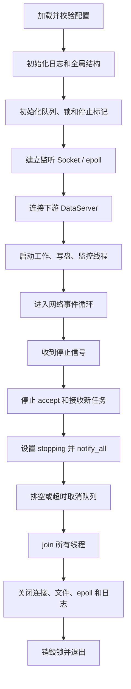

# 07 TCP 游戏聊天服务器整体设计

这个案例把前面学到的线程、生产者—消费者、日志、TCP 和 I/O 多路复用组合成一个分层系统。整体由 Client、LogicServer 和 DataServer 组成：客户端负责交互，逻辑服务负责在线状态与业务，数据服务负责历史缓存和持久化。

## 1. 总体请求流程



最重要的业务约束是：**聊天消息先交给 DataServer 保存，LogicServer 收到成功 ACK 后再向频道广播**。这样客户端看到的消息与已确认持久化的消息尽量保持一致。

## 2. 编码前先搭系统骨架

### 核心数据结构

```cpp
struct Session {
    uint64_t connection_id;
    int fd;
    std::string nickname;
    std::string channel;
    TimePoint last_active;
    SessionState state;
};

struct ChatMessage {
    uint64_t request_id;
    std::string channel;
    std::string sender;
    std::string content;
    int64_t timestamp_ms;
};

struct Task {
    TaskType type;
    uint64_t connection_id;
    ChatMessage message;
};
```

仅用 fd 识别客户端不够稳妥，因为 fd 关闭后可能被系统复用。任务里加入递增的 `connection_id`，工作线程返回结果时可以确认会话仍是原来的连接。

### 全局状态和所有权

| 状态 | 建议所有者 | 访问规则 |
| --- | --- | --- |
| 在线 Session 表 | Logic 网络线程 | 工作线程通过任务和结果访问，不直接删除连接 |
| 频道成员索引 | Logic 网络线程 | 登录、退出和断线时同步更新 |
| Logic 任务队列 | 网络线程生产，工作线程消费 | mutex + not_empty/not_full |
| 待确认请求表 | Logic 网络线程 | request_id → connection/channel/message |
| Data 写盘队列 | Data 网络线程生产，写盘线程消费 | mutex + condition variables |
| 每频道历史缓存 | Data 写盘线程或受锁保护 | 每频道最多 20 条 |
| 停止标记 | 各服务主线程 | 原子变量或统一同步域 |

### 线程框架

| 进程 | 线程 | 主要职责 | 阻塞点 | 退出条件 |
| --- | --- | --- | --- | --- |
| Client | 主线程 | 读取键盘、发送消息 | 标准输入 | `/quit` 或连接失败 |
| Client | 网络接收/事件线程 | 收包、解包、显示、心跳定时 | socket/poll | 服务端关闭或停止 |
| LogicServer | 网络线程 | accept、recv、拆包、入队、发送 | epoll | stopping |
| LogicServer | 工作线程池 | 业务判断、Data 请求、结果处理 | 任务队列 | stopping 且队列空 |
| LogicServer | 监控/清理线程 | 超时会话、队列与在线数统计 | 定时等待 | stopping |
| DataServer | 网络线程 | 接收存储请求、解析、入写盘队列 | epoll | stopping |
| DataServer | 写盘线程 | 缓存、追加文件、生成 ACK | 写盘队列/文件 I/O | stopping 且队列空 |

## 3. Client 设计

### 职责

- 启动参数：指定服务器地址、端口、昵称和频道；
- 配置文件：提供默认地址、显示格式、历史显示上限等；
- 聊天界面：消息带时间戳和发送者，维护最多约 100 条显示记录；
- 双向网络：用户输入随时可发，同时持续接收服务端消息；
- 心跳：每 30 秒发送 PING，避免被服务端判定为失活；
- 安全退出：输入 `/quit` 后发送退出请求并有序关闭连接。

### 启动和事件循环



配置文件与命令行的优先级应明确：通常内置默认值 < 配置文件 < 命令行参数。所有端口、时间和容量都要校验范围。

## 4. LogicServer 设计

### 职责

1. 读取并强制校验配置，例如监听端口、工作线程数、DataServer 地址和重试参数；
2. 监听固定端口并接受客户端连接；
3. 作为 TCP 客户端连接 DataServer；
4. 管理昵称、频道、最后活跃时间和连接状态；
5. 网络线程只收包、拆包、生成任务并入队；
6. 工作线程处理任务，并把存储请求发送给 DataServer；
7. 收到 DataServer 成功 ACK 后才广播消息；
8. DataServer 断开时按间隔和次数重连；
9. 定期清理掉线/超时会话并释放资源；
10. 每 60 秒输出在线人数和任务积压等运行状态。

### 网络线程到工作线程



### 存盘确认后广播



PendingRequest 必须有超时和连接代次检查。客户端在等待期间断线，ACK 返回时不能把结果发给复用同一 fd 的新客户端。

### 心跳和僵尸连接清理

LogicServer 根据 `last_active` 判断客户端是否超时。删除会话时需要一次完成：从 epoll 删除 fd、从在线表和频道索引删除、取消或标记待处理请求、广播离开消息、关闭 fd。不要只从一个容器删除。

## 5. DataServer 设计

### 职责

- 校验监听端口、写入线程数、缓存上限和日志文件路径；
- 监听 LogicServer 连接；
- 网络线程把聊天记录解析为 `WriteTask` 后压入有界写盘队列；
- 写盘线程维护每频道最近 20 条历史记录；
- 把完整聊天记录追加到本地文件，例如 `dataserver.log`；
- 文件写入成功后才向 LogicServer 返回 ACK。

### 异步写盘流程



“网络线程不阻塞”并不代表可以无限入队。队列满时必须选择阻塞、超时拒绝或背压；否则内存会无限增长。

## 6. 协议最少需要哪些字段

| 字段 | 用途 |
| --- | --- |
| `version` | 协议兼容和升级 |
| `message_type` | LOGIN、CHAT、PING、PONG、QUIT、ACK、ERROR 等 |
| `request_id` | 把异步 DataServer ACK 对应回原请求 |
| `body_length` | TCP 拆包与上限校验 |
| `connection/session_id` | 识别会话，避免只依赖 fd |
| `channel` | 广播和历史缓存分组 |
| `timestamp` | 显示、排序和审计 |
| `status/error_code` | 区分成功、可重试失败和协议错误 |

所有网络输入都不可信：先检查帧长度，再解析字段，限制昵称、频道和消息长度，并拒绝未知类型。

## 7. 服务启动与退出



## 8. 失败场景

| 场景 | 处理原则 |
| --- | --- |
| Client 连不上 Logic | 按配置重试，超过次数后清晰退出 |
| Logic 与 Data 断开 | 标记下游不可用，重连期间拒绝或暂存写请求 |
| Data 写盘失败 | 返回失败 ACK，Logic 不广播该消息 |
| Logic 任务队列满 | 限流或返回忙，不能无限分配内存 |
| 客户端停止心跳 | 超时后统一清理 Session 和频道索引 |
| ACK 超时 | 删除 PendingRequest，并向仍存活客户端返回超时 |
| 服务退出 | 停止生产、唤醒消费者、排空队列、join 后释放资源 |

## 9. 与实现仓库的关系

本章还原的是原整体设计文档中的本地持久化、20 条历史缓存、PING/PONG 和存盘确认流程。后续独立项目 [`tcp-game-chat-redis`](https://github.com/feiyun0310/tcp-game-chat-redis) 使用 Protobuf 和 Redis 实现了相近的分层思想，具体实现边界以项目仓库 README 和源码为准。

对应学习代码：[`examples/chat_logicserver.cpp`](examples/chat_logicserver.cpp) 与 [`examples/chat_dataserver.cpp`](examples/chat_dataserver.cpp)。

## 10. 实现前检查清单

- [ ] Session、ChatMessage、Task、WriteTask 和 ACK 是否先定义清楚？
- [ ] 每个全局容器由哪个线程拥有、由哪把锁保护？
- [ ] 网络线程、工作线程、写盘线程和监控线程如何退出？
- [ ] TCP 输入是否有长度前缀、上限和半包缓冲？
- [ ] 消息是否真的在持久化成功后才广播？
- [ ] 任务队列和写盘队列满时怎样背压？
- [ ] fd 复用、断线、ACK 超时和下游重连是否覆盖？
- [ ] 退出时是否先停止生产，再唤醒、排空和 join？
