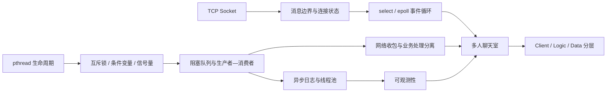
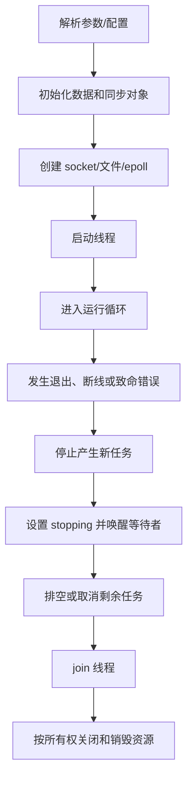

# 08 学习复盘与下一步

这段学习最大的变化，不只是认识了更多 Linux API，而是开始在编码之前先建立程序模型：数据是什么、状态归谁、线程如何协作、系统如何启动和退出、异常时保持哪些不变量。

## 1. 已形成的知识链

## 2. 我的程序设计顺序

以后写并发或网络程序时，先按下面顺序准备，再开始填业务代码：

### A. 写数据结构

- 核心实体：Client、Session、Message、Task、Result；
- 队列与缓冲：容量、读写位置、当前大小、关闭标记；
- 每个字段的不变量和最大长度；
- 结构体是否拥有数据，还是只借用指针。

### B. 列全局状态

把确实需要跨模块或跨线程共享的状态集中列成表格：谁读、谁写、由哪把锁保护、何时初始化、何时释放。能由一个线程独占的数据就不要做成任意线程都可写的全局变量。

### C. 画线程框架

为每个线程写清入口函数、输入、输出、阻塞位置、共享资源、退出条件。先确定“网络线程只收包和排队”“工作线程处理业务”“写盘线程执行慢 I/O”，再写具体函数。

### D. 画生命周期

### E. 写函数骨架

先写函数声明、返回值和错误语义，例如 `Init`、`Start`、`Push`、`Pop`、`HandleMessage`、`Shutdown`。骨架能编译后，再逐个函数填充逻辑。

### F. 验证不变量和异常分支

每完成一层都问：空输入、满队列、余额不足、连接关闭、部分发送、超时、线程创建失败时会怎样？不要等所有功能写完才一起调试。

## 3. 写程序前的一页设计表

| 项目 | 要写清楚的内容 |
| --- | --- |
| 目标 | 输入、输出、并发规模、延迟/可靠性要求 |
| 数据结构 | 字段、所有权、容量、状态枚举、不变量 |
| 全局状态 | 读者、写者、锁、初始化和销毁顺序 |
| 线程模型 | 线程数量、职责、阻塞点、退出条件 |
| 网络协议 | 消息头、长度、类型、请求 ID、最大帧 |
| 正常流程 | 启动、收包、处理、返回、广播 |
| 异常流程 | 超时、断线、重连、队列满、存储失败 |
| 资源回收 | fd、内存、锁、条件变量、线程、文件 |
| 可观测性 | 日志级别、关键字段、统计指标 |
| 验证 | 单元测试、并发测试、故障注入、压力测试 |

## 4. 调试方法

### 从最小场景开始

1. 单线程验证数据结构操作；
2. 一个生产者和一个消费者；
3. 一个客户端和一个服务端；
4. 再增加线程数、客户端数和异常输入；
5. 最后测试退出、重连和压力。

### 日志必须能回答的问题

- 哪个时间、哪个线程、哪个连接发生了什么？
- 请求 ID、消息类型、队列长度和状态转换是什么？
- 是客户端断开、协议错误、下游失败还是本地资源失败？
- 资源是否被创建、转移所有权和最终释放？

### 推荐工具

| 工具 | 用途 |
| --- | --- |
| `gdb` | 断点、线程栈、崩溃现场 |
| `strace` | 查看 socket、文件和等待相关系统调用 |
| AddressSanitizer | 越界、Use-after-free、重复释放 |
| ThreadSanitizer | 数据竞争和部分锁使用问题 |
| Valgrind | 内存泄漏与非法访问检查 |
| `ss` / `lsof` | 检查监听端口和连接状态 |
| `perf` | 定位 CPU 热点和锁竞争 |

## 5. 当前仍需加强的地方

- 对 C/C++ 对象生命周期、所有权和 RAII 的掌握；
- 非阻塞 Socket 的输出队列、背压和慢客户端治理；
- 请求 ID、幂等、超时、取消和重试之间的关系；
- 多服务下的数据一致性、服务发现和故障恢复；
- 自动化测试、持续集成和可重复的性能基准；
- 指标、追踪和结构化日志等可观测性能力。

## 6. 下一阶段计划

1. 为每个示例补 Makefile/CMake 和统一编译命令；
2. 为 BlockingQueue、协议拆包和状态机编写单元测试；
3. 使用 Sanitizer 检查银行账户、生产者—消费者和聊天服务器；
4. 给 epoll 服务器实现每连接输入/输出缓冲与背压；
5. 记录连接数、吞吐量、广播延迟、队列高水位和丢弃数；
6. 对比固定地址分层服务与 ZooKeeper 服务发现架构；
7. 把“设计表 → 骨架 → 实现 → 测试 → 复盘”固化为每个项目的 README 或设计文档。

## 7. 完成标准

一个程序“能跑一次”不等于完成。更完整的完成标准包括：

- 正常流程可重复执行；
- 输入和网络消息都有边界校验；
- 并发状态没有已知数据竞争；
- 所有线程都能被通知并正常退出；
- 所有资源都有明确所有者并能回收；
- 失败时有可解释的错误和日志；
- 编译、运行和验证步骤可以被其他人复现；
- 已知限制被清楚记录，而不是隐藏。
