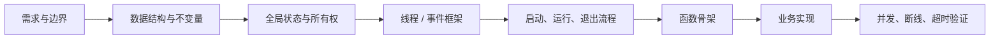
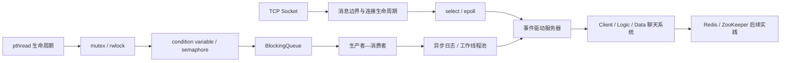

# Linux C/C++ 后端学习笔记

> 从线程同步到事件驱动网络编程的一条渐进式学习路线。笔记不仅列出概念，还补充 API 用法、数据结构、线程框架、正常/异常流程图和可阅读的代码案例。

## Portfolio Summary

This repository documents my progression through Linux backend fundamentals: POSIX threads, synchronization, producer–consumer queues, asynchronous logging, TCP, I/O multiplexing, and a layered chat-server case study. The expanded notes emphasize how APIs are used, who owns shared state, how threads start and stop, and how failure paths are designed before business logic is implemented.

## 我的核心编程方法

这段学习让我形成了一个稳定顺序：**先写数据结构 → 列出全局状态及所有权 → 设计线程/事件循环框架 → 画启动与退出流程 → 写函数骨架 → 填业务逻辑 → 验证异常与并发路径**。

完整方法、线程表和编码前检查清单见 [01 学习路线与程序设计方法](01-learning-roadmap.md)。

## 章节与关键字索引

| 章节 | 重点关键字/API | 学会如何使用 |
| --- | --- | --- |
| [01 学习路线与程序设计方法](01-learning-roadmap.md) | 数据结构、全局状态、线程表、不变量、生命周期 | 在写业务代码前搭出完整程序骨架 |
| [02 线程与同步](02-threads-and-synchronization.md) | `pthread_create`、`join`、mutex、rwlock、cond、semaphore | 创建/回收线程，选择同步工具，避免死锁与参数失效 |
| [03 并发实践](03-concurrency-practices.md) | 银行账户、`pthread_cond_wait`、BlockingQueue、`TryPush/TryPop` | 写余额等待、有界队列、超时和关闭流程 |
| [04 日志系统](04-logging-system.md) | level、宏、`__FILE__`、双缓冲、滚动、背压 | 从同步日志逐步设计异步线程安全组件 |
| [05 I/O 多路复用](05-io-multiplexing.md) | `fd_set`、`select`、`epoll_create1`、`epoll_ctl`、`epoll_wait` | 管理多连接，理解 LT/ET、输出队列和 `EAGAIN` |
| [06 TCP 编程](06-tcp-programming.md) | `socket`、`bind`、`listen`、`accept`、`connect`、`recv/send` | 建立服务端/客户端，处理半包、部分发送与关闭 |
| [07 游戏聊天服务器](07-game-chat-server.md) | Client/Logic/Data、任务队列、心跳、ACK、重连 | 设计三层服务和“存盘成功后广播”的完整流程 |
| [08 复盘与下一步](08-review-and-next-steps.md) | 设计表、调试、Sanitizer、完成标准 | 把学习方法固化为可复用的工程检查清单 |

## 知识关系

## PDF 内容在笔记中的对应位置

| 原始学习资料 | 扩写后的内容 |
| --- | --- |
| 线程 | pthread 创建、参数生命周期、锁、读写锁、条件变量、信号量、死锁 |
| 多线程银行账户系统 | 数据结构、3 存款/2 取款线程、余额不足等待、完整流程图 |
| 生产者消费者模型 | 容量 20 的阻塞队列、not_full/not_empty、超时 Push/Pop、统计线程 |
| 日志 | 六阶段功能、异步队列、双缓冲、分类、文件滚动和满缓冲策略 |
| TCP 服务端 | Socket API、监听/通信 fd、双向收发线程、shutdown 与 close |
| I/O 多路复用 | 阻塞/轮询/select/epoll 对比、聊天室事件循环和 LT/ET |
| TCP 游戏聊天服务器整体设计 | Client 心跳、Logic 工作队列、Data 写盘队列、20 条缓存和 ACK 后广播 |

## 代码案例

| 案例 | 对应主题 | 重点观察 |
| --- | --- | --- |
| [`bank_account.c`](examples/bank_account.c) | 互斥与条件变量 | 临界区、余额不变量、等待与唤醒 |
| [`producer_consumer.cpp`](examples/producer_consumer.cpp) | 生产者—消费者 | 有界队列、非空/非满条件、退出 |
| [`logging_system.cpp`](examples/logging_system.cpp) | 日志组件 | 多线程写入、消息队列、文件落盘 |
| [`epoll_chat_server.c`](examples/epoll_chat_server.c) | I/O 多路复用 | 事件循环、连接管理、广播 |
| [`epoll_chat_client.c`](examples/epoll_chat_client.c) | TCP 客户端 | 标准输入和网络事件协作 |
| [`chat_logicserver.cpp`](examples/chat_logicserver.cpp) | 聊天逻辑层 | 会话、频道、任务队列和转发 |
| [`chat_dataserver.cpp`](examples/chat_dataserver.cpp) | 聊天数据层 | 历史消息与数据接口 |

> 示例主要用于学习和结构分析。仓库没有声明全部代码已经通过统一 CI；请在 Linux 目标环境中按章节说明编译，并结合 Sanitizer 和压力场景继续验证。

## 建议阅读和实践方式

1. 先读 01 章，拿一张纸列出数据结构、全局状态和线程表；
2. 阅读 02～06 章时，把每个 API 放回完整生命周期中理解，不孤立背函数名；
3. 编译 `examples/`，先运行最小线程/连接数，再增加并发和异常输入；
4. 阅读 07 章，对照 [`tcp-game-chat-redis`](https://github.com/feiyun0310/tcp-game-chat-redis) 查看设计如何进入实现；
5. 阅读 08 章，用检查清单复盘资源所有权、退出流程和未覆盖风险；
6. 对比 [`ab-fight-zookeeper`](https://github.com/feiyun0310/ab-fight-zookeeper)，继续理解服务拆分与发现。

## 我建立的能力

| 能力 | 具体体现 |
| --- | --- |
| 程序建模 | 先定义实体、状态、不变量、所有权和生命周期 |
| 并发推理 | 区分互斥与条件等待，设计有界队列和可结束线程 |
| 网络协议意识 | 把 TCP 当作字节流，处理消息边界、部分收发和断线 |
| 事件驱动设计 | 使用 select/epoll 管理就绪事件并隔离耗时任务 |
| 服务分层 | 拆分客户端、逻辑与数据职责，定义 ACK 和失败语义 |
| 工程复盘 | 明确当前验证程度、已知限制和下一步测试方法 |

## 局限与下一步

- 为全部案例补充统一 Makefile/CMake、自动化测试和 GitHub Actions；
- 使用 AddressSanitizer、ThreadSanitizer、Valgrind 和压力测试做系统验证；
- 继续完善非阻塞发送、背压、请求超时、断线重连和优雅退出；
- 为完整项目记录连接数、吞吐量、延迟分位数、队列高水位和错误率；
- 将每次项目实践都按“设计表—骨架—实现—验证—复盘”记录。

## 仓库说明

本仓库是个人学习过程的结构化整理。内容以原始学习资料和练习为基础重新归纳，并补充了便于理解 API 使用顺序的流程图与工程注意事项。它展示的是学习方法、程序设计思路和持续改进过程，不代表生产级框架。
