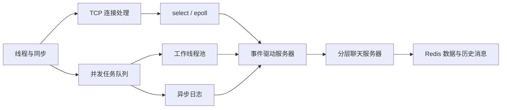

# Linux C/C++ 后端学习笔记

> 从线程同步到事件驱动网络编程的一条渐进式学习路线，并配套可阅读、可编译的代码案例。

## Portfolio Summary

This repository documents my progression through Linux backend fundamentals: POSIX threads, synchronization, producer–consumer queues, logging, TCP, I/O multiplexing, and a layered chat-server case study. It emphasizes not only API usage, but also concurrency invariants, protocol boundaries, failure handling, and the reasoning behind each design choice.

## 作品集亮点

- **知识链条完整**：从线程与锁出发，逐步过渡到任务队列、日志组件、TCP 粘包处理、`select`/`epoll` 和多服务聊天系统。
- **理论与代码对应**：关键章节配有独立案例，便于在 Linux 环境中复现、调试和继续扩展。
- **强调工程边界**：笔记不仅记录“怎么写”，也讨论竞态、死锁、半包、断线、背压和资源回收等问题。
- **形成项目闭环**：最终案例将网络层、逻辑层、数据层和 Redis 串联起来，并与独立项目仓库相互印证。

## 学习路线

| 阶段 | 内容 | 主要产出 |
| --- | --- | --- |
| 1 | [整体学习路线](01-learning-roadmap.md) | 建立 Linux 后端知识地图与阶段目标 |
| 2 | [线程与同步](02-threads-and-synchronization.md) | 理解线程生命周期、互斥锁、条件变量与同步边界 |
| 3 | [并发实践](03-concurrency-practices.md) | 银行账户与生产者—消费者模型，练习共享状态保护 |
| 4 | [日志系统](04-logging-system.md) | 将并发队列、格式化输出和文件写入组合成基础组件 |
| 5 | [I/O 多路复用](05-io-multiplexing.md) | 对比阻塞 I/O、`select` 与 `epoll` 的事件处理方式 |
| 6 | [TCP 编程](06-tcp-programming.md) | 梳理连接建立、字节流协议、粘包/半包和异常关闭 |
| 7 | [游戏聊天服务器](07-game-chat-server.md) | 分层设计 LogicServer、DataServer、Redis 与客户端 |
| 8 | [复盘与下一步](08-review-and-next-steps.md) | 汇总能力边界、问题清单和后续学习计划 |

## 知识之间的关系

## 代码案例

| 案例 | 对应主题 | 重点观察 |
| --- | --- | --- |
| [`bank_account.c`](examples/bank_account.c) | 互斥与共享账户 | 临界区、余额不变量、线程安全 |
| [`producer_consumer.cpp`](examples/producer_consumer.cpp) | 生产者—消费者 | 有界队列、条件变量、退出条件 |
| [`logging_system.cpp`](examples/logging_system.cpp) | 日志组件 | 多线程写入、消息队列、文件落盘 |
| [`epoll_chat_server.c`](examples/epoll_chat_server.c) | I/O 多路复用 | 事件循环、连接管理、广播 |
| [`epoll_chat_client.c`](examples/epoll_chat_client.c) | TCP 客户端 | 标准输入与网络事件协作 |
| [`chat_logicserver.cpp`](examples/chat_logicserver.cpp) | 聊天逻辑层 | 会话、频道与消息转发 |
| [`chat_dataserver.cpp`](examples/chat_dataserver.cpp) | 聊天数据层 | Redis 历史消息与数据接口 |

> 这些案例用于学习与结构分析。仓库给出了 Linux 下的复现方向，但当前版本没有声明全部案例已通过统一 CI；编译器版本和依赖差异仍需在目标环境中验证。

## 我从这条路线中建立的能力

| 能力 | 在仓库中的体现 |
| --- | --- |
| 并发推理 | 用不变量分析共享数据，识别竞态、死锁和丢失唤醒 |
| 网络协议意识 | 将 TCP 视为字节流，显式处理消息边界与异常连接 |
| 事件驱动设计 | 理解 `select`/`epoll` 的适用场景和连接状态管理 |
| 模块化设计 | 拆分网络、业务、存储职责，并定义模块间协议 |
| 工程复盘 | 记录限制、验证方法和可以继续改进的方向 |

## 推荐使用方式

1. 按章节顺序阅读，先理解约束和不变量，再看代码。
2. 在 Linux 环境中单独编译 `examples/` 下的案例，并使用多次运行、异常输入和并发压力观察行为。
3. 将第 7 章与 [`tcp-game-chat-redis`](https://github.com/feiyun0310/tcp-game-chat-redis) 对照，查看知识如何落到完整项目。
4. 将服务发现相关内容延伸到 [`ab-fight-zookeeper`](https://github.com/feiyun0310/ab-fight-zookeeper)，比较固定地址与注册中心两种架构。

## 关键认识

1. 锁保护的不是一行代码，而是一组必须同时成立的状态不变量。
2. 条件变量必须与条件判断和互斥锁共同使用，并在循环中重新检查条件。
3. TCP 只保证可靠字节流，不保留应用消息边界；协议必须自己解决长度、类型和关联关系。
4. `epoll` 提升的是大量连接的事件管理效率，业务耗时仍应从事件循环中移出。
5. 分层并不等于简单增加进程；每次拆分都需要明确数据所有权、失败语义和可观测性。

## 局限与下一步

- 为案例补充 Makefile/CMake、自动化测试和 GitHub Actions。
- 使用 AddressSanitizer、ThreadSanitizer 与压力测试验证内存和并发安全。
- 补充非阻塞发送、背压、连接重试、优雅退出和结构化日志。
- 为完整项目加入性能指标，例如连接数、吞吐量、延迟分位数和 Redis 操作耗时。

## 仓库说明

本仓库是个人学习过程的结构化整理。内容以原始课程/练习材料为基础重新归纳，示例中的风险和未验证项会尽量明确标注；它展示的是学习方法、工程思考和持续改进过程，而不是生产级框架。
